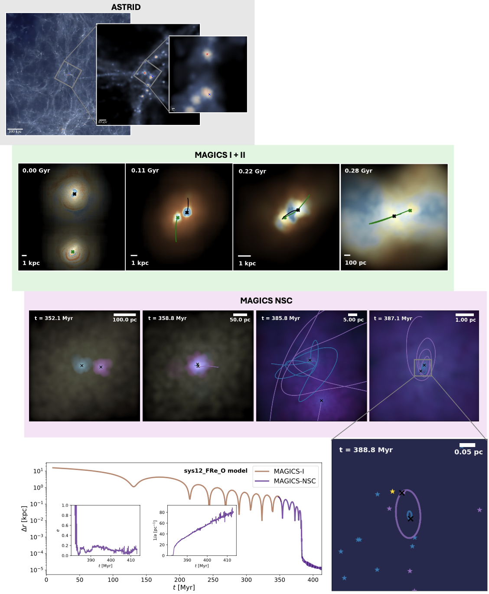
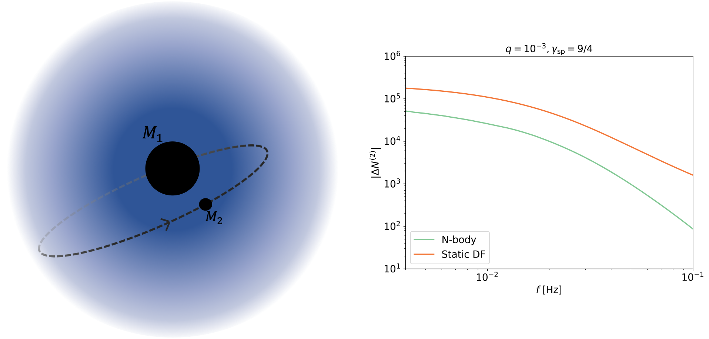
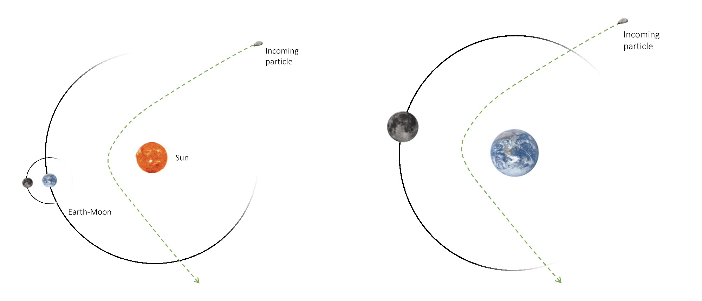
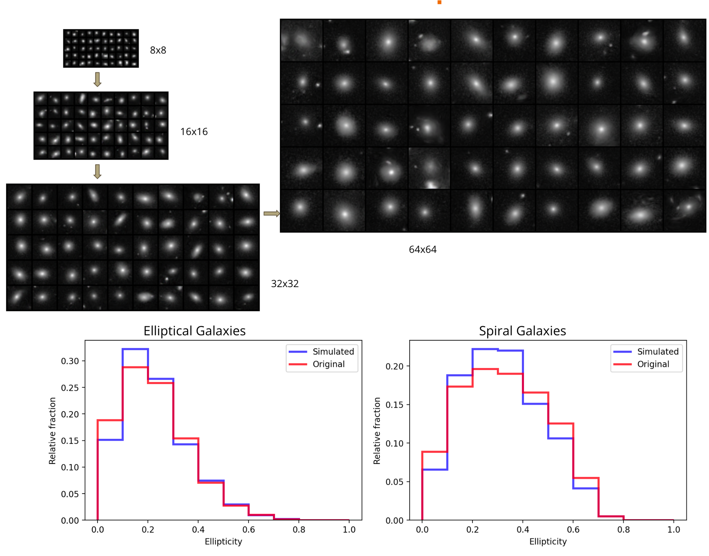
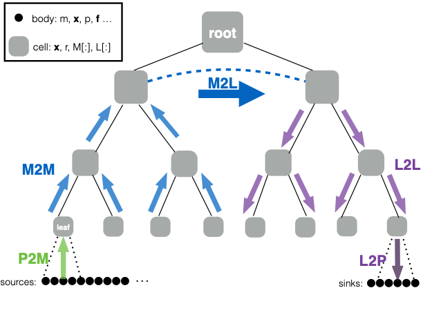

## Nuclear star clusters and massive black hole binaries

I am primarily involved and interested in problems related to the effect of nuclear star clusters (NSCs) on massive black hole (MBH) binaries. I use N-body simulations to study mergers of massive black holes in a variety of NSC dominated environments. Using Taichi, an FMM based N-body code that uses AR-chain regularization, my collaborators and I studied how mass segregated NSCs affect the hardening and mergers of MBH binaries. My current work involves studying the effect of NSCs in high redshift MBH seed mergers in dwarf galaxies. Our work suggests that NSCs provide the dominant channel for seed MBH mergers in high redshift galaxies.

### Related publications
1. [_Evolution of massive black hole binaries in collisionally relaxed nuclear star clusters–Impact of mass segregation_ (2022)  **Mukherjee, D.**, Zhu, Q., Ogiya, G., Rodriguez, C. L., & Trac, H. Monthly Notices of the Royal Astronomical Society, 518(4), 4801-4817](https://academic.oup.com/mnras/article-abstract/518/4/4801/6840259)
2. [_MAGICS I. The First Few Orbits Encode the Fate of Seed Massive Black Hole Pairs_ (2024) Chen, N., **Mukherjee, D.**, Di Matteo, T., Ni, Y., Bird, S., & Croft, R.  The Open Journal of Astrophysics ](https://doi.org/10.33232/001c.116179)
3. _MAGICS II. The crucial role of tidal stripping for seed black hole binary evolution_(2024) Zhou, Y., **Mukherjee, D.**, Chen, N., Di Matteo, T., Di Carlo, U.N., Johansson, P.H., Rantala, A., & Partmann, C. (in-prep)
4.  _MAGICS III. Seeds sink swiftly: nuclear star clusters dramatically accelerate seed black hole mergers_(2024)  **Mukherjee, D.**, Zhou, Y. ,Chen, N., Di Matteo, T., Di Carlo, U.N. (in-prep)

## Dark matter spikes

Recent studies posit the existence of dark matter spikes around intermediate mass black holes (IMBHs). The effect of such spikes on compact objects inspiraling into IMBHs have been studied using analytic and semi-analytic methods. The gravitational effect of the spike can be detectable as a dephasing effect in the GW signal. My collaborators and I performed N-body simulations of such inspirals using a custom built N-body code, Falcon, that takes into account post Newtonian effects upto 2.5 order. We found that, contrary to previous investigations, three-body effects play a more dominant role in the dephasing effects. Our results also suggest that DM spikes erode much faster than previously considered. Thus we find that GW effects of such spikes in previous studies may have been overestimated.

### Related publications
1. [_Examining the Effects of Dark Matter Spikes on Eccentric Intermediate Mass Ratio Inspirals Using  N-body Simulations_(2024) **Mukherjee, D.**, Holgado, A. Miguel, Ogiya, Go & Trac, H. Monthly Notices of the Royal Astronomial Society, 533(2) 2335-2355](https://academic.oup.com/mnras/advance-article/doi/10.1093/mnras/stae1989/7737663)

## Capture and evolution of interstellar objects

I am also interested in topics related to planetary dynamics pertaining to the capture and detection of interstellar objects in the solar system. We used a hybrid integrator that combines a time-symmetrized P(EC)^3 Hermite scheme with a Kepler solver to rapidly evolve a population of interstellar objects to study their capture and retention. Our investigations reveal that 1-m sized interstellar objects can be captured efficiently in near earth orbit. Such objects typically survive in near earth orbit for 0.1-1 Myr until they are ejected. Future work would involve identifying the distinctive feature of orbits of such captured objects and comparing them to objects that arise in the solar system. We are interested in using ML based methods to study this. 

### Related publications
1. [_Close encounters of the interstellar kind: exploring the capture of interstellar objects in near-Earth orbit_ (2023) **Mukherjee, D.**, Siraj, A., Trac, H., & Loeb, A. Monthly Notices of the Royal Astronomial Society, 525(1), 908-921](https://academic.oup.com/mnras/article/525/1/908/7233732)

## Machine learning

On the machine learning side of things, I have worked with generative adversarial networks (GANs) and Hamiltonian neural networks (HNNs). In the former case, I worked with progressive GANs to generate physically realistic galaxy images after training our model on the GalaxyZoo dataset. The test set was divided into two parts: spiral and elliptical galaxies, and the goal was to study how progressive GANs performed for both cases. We studied the distribution of ellipticity for the generated images in both cases, finding that the model is able to reproduce the distribution quite well. 
I am also interested in using HNNs to investigate ways to circumvent integration of small subsystems in N-body simulations. HNNs and SNNs (symplectic neural networks) can provide more accurate reproduction of orbital parameters than ordinary NNs.

## Numerical works

I also work on a variety of numerical problems related to fast long range force calculations using the fast multipole method (FMM) and more accurate integration schemes. For the former, my collaborators and I study ways to optimize and improve FMM for collisional N-body simulations. Our investiagtions have ranged from improvement of the M2L kernels to testing compiler based optimizations for task-parallel parallelization models. 
I am also interested in forward symplectic integration methods and timestep symmetrization. Forward symplectic methods are relatively new and alleviate the issue with negative timesteps in higher order symplectic methods. 

### Related publications
1. [_Fast Multipole Methods for N-body Simulations of Collisional Star Systems_ **Mukherjee, D.**, Zhu, Q., Trac, H., Rodriguez, C.L. ApJ 916 9](https://iopscience.iop.org/article/10.3847/1538-4357/ac03b2)
